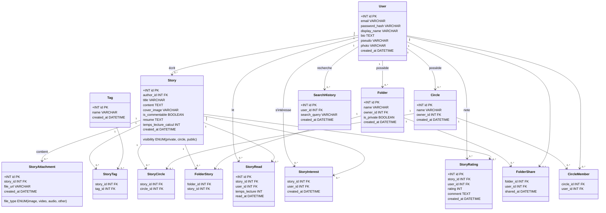

```mermaid
classDiagram

%% =========================
%% CORE ENTITIES
%% =========================

class User {
  +INT id PK
  email VARCHAR
  password_hash VARCHAR
  display_name VARCHAR
  bio TEXT
  pseudo VARCHAR
  photo VARCHAR
  created_at DATETIME
}

class Story {
  +INT id PK
  author_id INT FK
  title VARCHAR
  content TEXT
  visibility ENUM(private, circle, public)
  cover_image VARCHAR
  is_commentable BOOLEAN
  resume TEXT
  temps_lecture_calcul INT
  created_at DATETIME
}

class StoryAttachment {
  +INT id PK
  story_id INT FK
  file_url VARCHAR
  file_type ENUM(image, video, audio, other)
  created_at DATETIME
}

class Folder {
  +INT id PK
  name VARCHAR
  owner_id INT FK
  is_private BOOLEAN
  created_at DATETIME
}

class Circle {
  +INT id PK
  name VARCHAR
  owner_id INT FK
  created_at DATETIME
}

class Tag {
  +INT id PK
  name VARCHAR
  created_at DATETIME
}

%% =========================
%% ASSOCIATIVE TABLES
%% =========================

class CircleMember {
  circle_id INT FK
  user_id INT FK
}

class FolderShare {
  folder_id INT FK
  user_id INT FK
  shared_at DATETIME
}

class StoryTag {
  story_id INT FK
  tag_id INT FK
}

class StoryCircle {
  story_id INT FK
  circle_id INT FK
}

class FolderStory {
  folder_id INT FK
  story_id INT FK
}

class StoryRead {
  +INT id PK
  story_id INT FK
  user_id INT FK
  temps_lecture INT
  read_at DATETIME
}

class StoryInterest {
  story_id INT FK
  user_id INT FK
  created_at DATETIME
}

class StoryRating {
  +INT id PK
  story_id INT FK
  user_id INT FK
  rating INT
  comment TEXT
  created_at DATETIME
}

class SearchHistory {
  +INT id PK
  user_id INT FK
  search_query VARCHAR
  created_at DATETIME
}

%% =========================
%% RELATIONSHIPS
%% =========================

User "1" --> "0..*" Story : écrit
User "1" --> "0..*" Folder : possède
User "1" --> "0..*" Circle : possède
User "1" --> "0..*" SearchHistory : recherche
User "1" --> "0..*" StoryRead : lit
User "1" --> "0..*" StoryInterest : s'intéresse
User "1" --> "0..*" StoryRating : note

Story "1" --> "0..*" StoryAttachment : contient
Story "1" --> "0..*" StoryTag
Story "1" --> "0..*" StoryCircle
Story "1" --> "0..*" FolderStory
Story "1" --> "0..*" StoryRead
Story "1" --> "0..*" StoryInterest
Story "1" --> "0..*" StoryRating

Tag "1" --> "0..*" StoryTag
Circle "1" --> "0..*" StoryCircle
Folder "1" --> "0..*" FolderStory
Folder "1" --> "0..*" FolderShare
Circle "1" --> "0..*" CircleMember

User "1" --> "0..*" CircleMember
User "1" --> "0..*" FolderShare
```