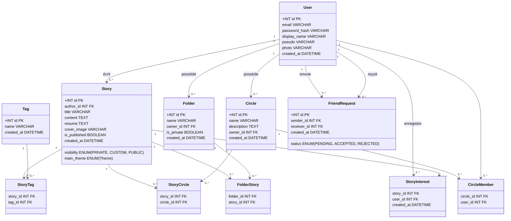

```mermaid
classDiagram

%% =========================
%% CORE ENTITIES
%% =========================

class User {
  +INT id PK
  email VARCHAR
  password_hash VARCHAR
  display_name VARCHAR
  pseudo VARCHAR
  photo VARCHAR
  created_at DATETIME
}

class Story {
  +INT id PK
  author_id INT FK
  title VARCHAR
  content TEXT
  resume TEXT
  cover_image VARCHAR
  visibility ENUM(PRIVATE, CUSTOM, PUBLIC)
  main_theme ENUM(Theme)
  is_published BOOLEAN
  created_at DATETIME
}

class Folder {
  +INT id PK
  name VARCHAR
  owner_id INT FK
  is_private BOOLEAN
  created_at DATETIME
}

class Circle {
  +INT id PK
  name VARCHAR
  description TEXT
  owner_id INT FK
  created_at DATETIME
}

class Tag {
  +INT id PK
  name VARCHAR
  created_at DATETIME
}

class FriendRequest {
  +INT id PK
  sender_id INT FK
  receiver_id INT FK
  status ENUM(PENDING, ACCEPTED, REJECTED)
  created_at DATETIME
}

%% =========================
%% ASSOCIATIVE TABLES
%% =========================

class CircleMember {
  circle_id INT FK
  user_id INT FK
}

class StoryTag {
  story_id INT FK
  tag_id INT FK
}

class StoryCircle {
  story_id INT FK
  circle_id INT FK
}

class FolderStory {
  folder_id INT FK
  story_id INT FK
}

class StoryInterest {
  story_id INT FK
  user_id INT FK
  created_at DATETIME
}

%% =========================
%% RELATIONSHIPS
%% =========================

User "1" --> "0..*" Story : écrit
User "1" --> "0..*" Folder : possède
User "1" --> "0..*" Circle : possède
User "1" --> "0..*" StoryInterest : enregistre
User "1" --> "0..*" FriendRequest : envoie
User "1" --> "0..*" FriendRequest : reçoit

Story "1" --> "0..*" StoryTag
Story "1" --> "0..*" StoryCircle
Story "1" --> "0..*" FolderStory
Story "1" --> "0..*" StoryInterest

Tag "1" --> "0..*" StoryTag
Circle "1" --> "0..*" StoryCircle
Circle "1" --> "0..*" CircleMember
Folder "1" --> "0..*" FolderStory

User "1" --> "0..*" CircleMember
```
