```mermaid
classDiagram
    direction TB

    %% ════════════════════════════════
    %%  ENTITÉS PRINCIPALES
    %% ════════════════════════════════

    class User {
        +Long id
        +String email
        +String passwordHash
        +String displayName
        +String pseudo
        +String bio
        +String photo
        +LocalDateTime createdAt
    }

    class Story {
        +Long id
        +User author
        +String title
        +String content
        +String resume
        +String coverImage
        +Visibility visibility
        +Theme mainTheme
        +boolean published
        +LocalDateTime createdAt
    }

    class Tag {
        +Long id
        +String name
        +LocalDateTime createdAt
    }

    class Folder {
        +Long id
        +String name
        +User owner
        +boolean privateFolder
        +LocalDateTime createdAt
    }

    class Circle {
        +Long id
        +String name
        +String description
        +User owner
        +LocalDateTime createdAt
    }

    class FriendRequest {
        +Long id
        +User sender
        +User receiver
        +FriendRequestStatus status
        +LocalDateTime createdAt
    }

    %% ════════════════════════════════
    %%  TABLES D'ASSOCIATION
    %% ════════════════════════════════

    class StoryTag {
        +StoryTagId id
        +Story story
        +Tag tag
    }

    class StoryInterest {
        +StoryInterestId id
        +Story story
        +User user
        +LocalDateTime createdAt
    }

    class StoryCircle {
        +StoryCircleId id
        +Story story
        +Circle circle
    }

    class FolderStory {
        +FolderStoryId id
        +Folder folder
        +Story story
    }

    class FolderShare {
        +FolderShareId id
        +Folder folder
        +User user
        +LocalDateTime sharedAt
    }

    class CircleMember {
        +CircleMemberId id
        +Circle circle
        +User user
    }

    %% ════════════════════════════════
    %%  CLÉS COMPOSITES
    %% ════════════════════════════════

    class StoryTagId {
        +Long storyId
        +Long tagId
    }

    class StoryInterestId {
        +Long storyId
        +Long userId
    }

    class StoryCircleId {
        +Long storyId
        +Long circleId
    }

    class FolderStoryId {
        +Long folderId
        +Long storyId
    }

    class FolderShareId {
        +Long folderId
        +Long userId
    }

    class CircleMemberId {
        +Long circleId
        +Long userId
    }

    %% ════════════════════════════════
    %%  ÉNUMÉRATIONS
    %% ════════════════════════════════

    class Visibility {
        <<enumeration>>
        PUBLIC
        PRIVATE
        CIRCLE
    }

    class Theme {
        <<enumeration>>
        ROMANCE
        THRILLER
        SCI_FI
        FANTASY
        HORROR
        DRAMA
        ADVENTURE
        COMEDY
        MYSTERY
        OTHER
    }

    class FriendRequestStatus {
        <<enumeration>>
        PENDING
        ACCEPTED
    }

    %% ════════════════════════════════
    %%  RELATIONS
    %% ════════════════════════════════

    Story "n" --> "1" User : author
    Story "n" --> "1" Visibility
    Story "n" --> "1" Theme

    StoryTag "n" --> "1" Story
    StoryTag "n" --> "1" Tag
    StoryTag ..> StoryTagId : <<uses>>

    StoryInterest "n" --> "1" Story
    StoryInterest "n" --> "1" User
    StoryInterest ..> StoryInterestId : <<uses>>

    StoryCircle "n" --> "1" Story
    StoryCircle "n" --> "1" Circle
    StoryCircle ..> StoryCircleId : <<uses>>

    Folder "n" --> "1" User : owner

    FolderStory "n" --> "1" Folder
    FolderStory "n" --> "1" Story
    FolderStory ..> FolderStoryId : <<uses>>

    FolderShare "n" --> "1" Folder
    FolderShare "n" --> "1" User
    FolderShare ..> FolderShareId : <<uses>>

    Circle "n" --> "1" User : owner

    CircleMember "n" --> "1" Circle
    CircleMember "n" --> "1" User
    CircleMember ..> CircleMemberId : <<uses>>

    FriendRequest "n" --> "1" User : sender
    FriendRequest "n" --> "1" User : receiver
    FriendRequest "n" --> "1" FriendRequestStatus
```

# Diagramme de Classe — Heritage (MVP)

> Dernière mise à jour : refonte complète d'après les interfaces définies.
> Supprimés : StoryRating, StoryAttachment, SearchHistory, StoryRead, Story.commentable, Story.tempsLectureCalcul
> Ajoutés : Circle.description, FriendRequestStatus, Theme, Visibility

---

---

## Résumé par interface

| Interface | Entités utilisées | Champs clés affichés |
|---|---|---|
| **Inscription** | `User` | email, passwordHash, displayName (+ confirmPassword DTO only) |
| **Connexion** | `User` | email, passwordHash |
| **Fil de lecture** | `Story`, `User`, `StoryInterest`, `Theme` | title, content(120), coverImage, mainTheme, author.displayName, saveCount, createdAt |
| **Détail histoire** | `Story`, `User`, `StoryInterest`, `Tag`, `StoryTag` | title, resume, content, mainTheme, author.displayName, author.photo, saveCount, createdAt + suggestions |
| **Dossiers partagés** | `Folder`, `FolderStory` | name, storyCount, privateFolder=false |
| **Sauvegardes** | `Folder`, `FolderStory` | name, storyCount, privateFolder=true |
| **Détail collection** | `Folder`, `FolderStory`, `Story`, `User` | stories avec title, content(120), mainTheme, author.displayName... |
| **Ma bibliothèque** | `Story`, `StoryInterest` | title, content(120), mainTheme, published, saveCount (sans auteur) |
| **Création histoire** | `Story`, `Tag`, `StoryTag`, `StoryCircle`, `Folder`, `FolderStory` | title, content, coverImage, visibility, mainTheme, tags(prédéfinis), folderId, circleId |
| **Profil** | `User`, `Story`, `Folder`, `StoryInterest` | displayName, photo, storyCount, folderCount, savedCount |
| **Modification profil** | `User` | pseudo, bio, photo, displayName |
| **Groupes** | `Circle`, `CircleMember` | name, description, memberCount |
| **Créer groupe** | `Circle`, `CircleMember`, `FriendRequest` | name, description, memberIds (depuis liste amis) |
| **Mon réseau** | `FriendRequest`, `User` | sender.displayName, status (PENDING → accept/reject), contacts |
| **Recherche ami** | `User`, `FriendRequest` | displayName, photo, alreadyFriend, pendingRequest |
| **Partager histoire** | `StoryCircle` | storyId, circleId |

---

## Ce qui a été supprimé et pourquoi

| Supprimé | Raison |
|---|---|
| `StoryRating` | Pas de notes ni commentaires (V2) |
| `StoryAttachment` | Pas de pièces jointes (coverImage suffit) |
| `SearchHistory` | Recherche 100% côté frontend |
| `StoryRead` | Pas de tracking de lecture dans le MVP |
| `Story.commentable` | Pas de commentaires |
| `Story.tempsLectureCalcul` | Pas affiché, pas calculé |
